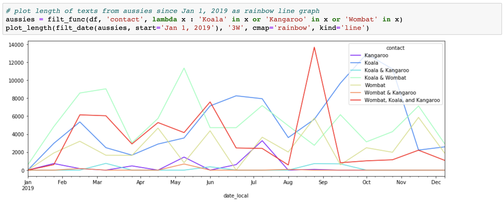
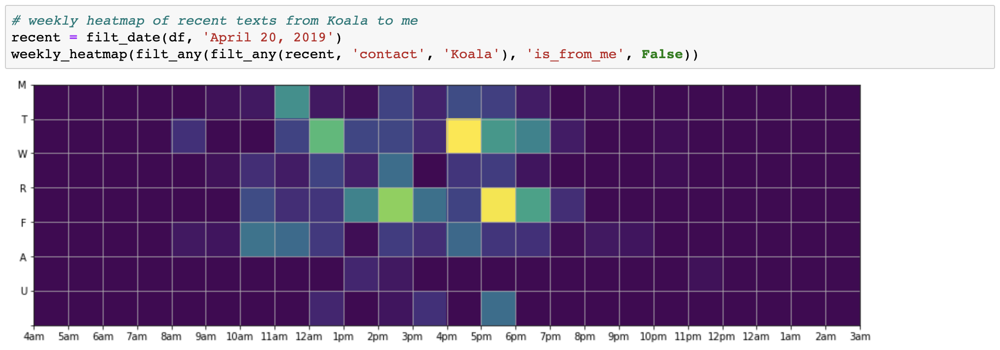

# Apple Messages Analytics Toolbox

The Apple Messages Analytics Toolbox (AMAT) is a collection of python tools for extracting and visualizing data from Apple Messages. This toolbox requires that the desktop Messages application is already synced with your iCloud account.

This toolbox does not directly access your iCloud account and does not engage in any network communications. All analytics are performed locally to preserve privacy. This repository is not affiliated with Apple Inc. in any way.

Here are some of the things you can do with this toolbox!

## Getting Started

First, make sure you've installed all of the required libraries:

- `numpy`
- `pandas`
- `matplotlib`
- `yaml`

Optionally, you may wish to use jupyter notebooks for interactive data analytics.

### Step 1: Database Conversion

The `sql2pandas.py` script converts your SQLite database into a pickled pandas DataFrame. To use this script, simply do the following:

1. Find your Messages database: `~/Library/Messages/chat.db`
2. **COPY** the `chat.db` file into the same directory as your `sql2pandas.py` script
3. Make sure your copied file is still called `chat.db`
4. Run `python sql2pandas.py` (this might take a while to finish)

Afterwards, you should see a new `chat_df.pkl` file and an `output` directory containing HTML previews of all of the chats in the database. The `chat.db` file is no longer needed, so you can safely delete the local copy (but first make sure it still the original appears in `~/Library/Messages`).

### Step 2: Chat ID Mapping

The Messages application does not associate contact information in the `chat.db` database. Instead, each chat dialogue is mapped to a chat ID. The easiest way to fix this is to manually create your own mapping from chat IDs to display names.

1. Open the `output/chats/chat_*.html` to identify the corresponding contacts
2. Add mappings to the `id_map.yaml` file using your favorite text editor

This step is optional. You can skip it entirely or only partially complete the id map before proceding to Step 3.

Note: two chat IDs can map to the same name (e.g. this may be useful if a person has two numbers or uses both SMS and iMessage)

### Step 3: Data Analytics

You can now load the chat data as a pandas `DataFrame` object. Open the example code to see what kinds of things you can do with the Apple Messages Analytics Toolkit. See the documentation below the complete toolbox API.

As you continue to use the Messages application, new data will not automatically be added to your pickled DataFrame. To incorprate new messages, you need to rebuild the `chat_df.pkl` file. Simply repeat Step 1 above. Your existing chat ID map will persist.

## Documentation

Full documetation is available [here](https://parkersruth.github.io/amat/)

